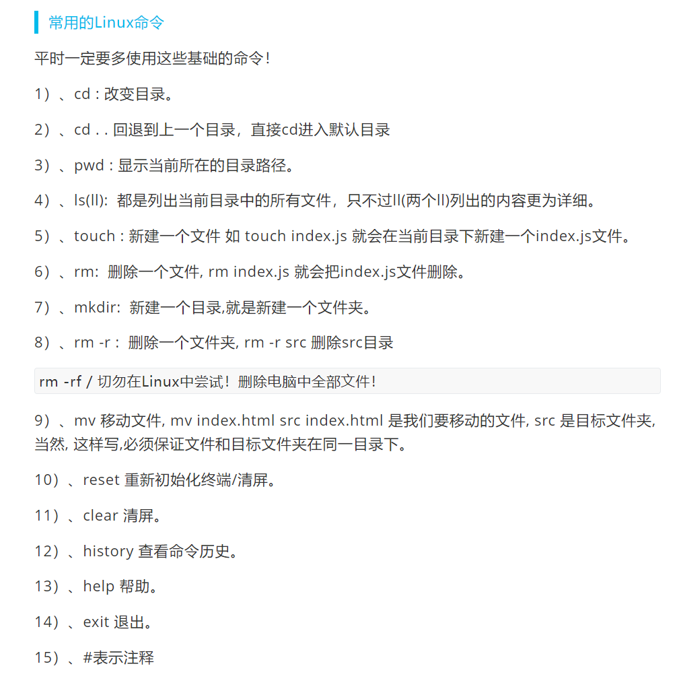
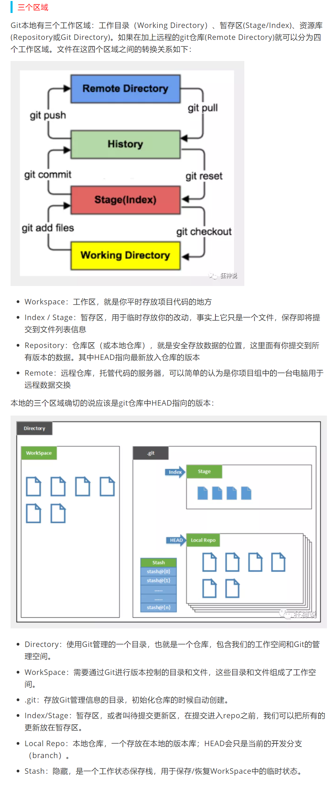
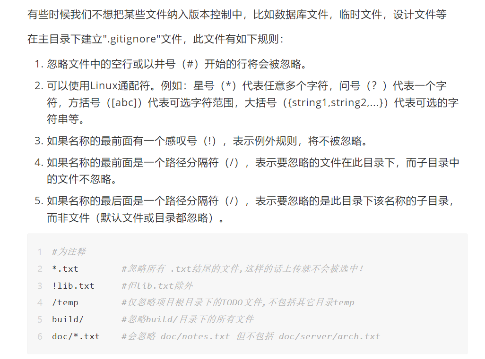

# Git相关

[学习视频](https://www.bilibili.com/video/BV1FE411P7B3?p=5&spm_id_from=pageDriver)
[文档参考](https://mp.weixin.qq.com/s/Bf7uVhGiu47uOELjmC5uXQ)

## Liunx常用命令



## Git配置
```
#查看配置
git config -l

#查看系统config
git config --system --list

#查看当前用户（global）配置
git config --global  --list
```
## Git配置文件路径
```
E:\Git bash\downlaod\Git\etc\gitconfig  ：Git 安装目录下的 gitconfig     --system 系统级

C:\Users\Mr.Zhu\ .gitconfig    只适用于当前登录用户的配置  --global 全局
```
## 设置用户名与邮箱（用户标识，必要）
```
git config --global user.name "Huaiyang Zhu"  #名称
git config --global user.email 1723071532@qq.com   #邮箱
```

## Git理论


## Git项目搭建及文件操作
```
git init                  #在当前目录新建一个Git代码库
git add .                 #添加所有文件至缓存区
git status                #查看所有文件状态
git commit -m "消息内容"   #提交暂存区中的内容到本地仓库 -m 提交信息
```
## 忽略文件


## 设置本机绑定SSH公钥
[参考链接](https://docs.github.com/cn/authentication/connecting-to-github-with-ssh/generating-a-new-ssh-key-and-adding-it-to-the-ssh-agent)
```
ssh-keygen -t ed25519 -C "1723071532@qq.com"
```
然后一路回车，公钥就生成完了

##连接远程仓库
[参考链接](https://blog.csdn.net/Rao_Limon/article/details/108418233)
```
git remote add origin git@github.com:djdodsjsjx/leaning-note.git  
```
##将本地仓库的文件推送至Github仓库
```
git push -u origin main
````

##总结
创建仓库时，下面三个选项不选
push时，有时网络不稳定，多试几次
```
git init 
git add . 
git commit -m "first" ("first"表示提交时的备注)
git branch -M main 
git remote add origin https://github.com/djdodsjsjx/-.git
git push -u origin main
```