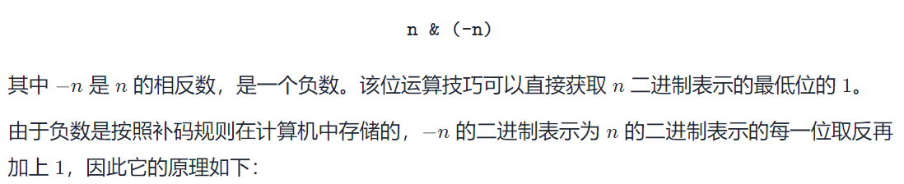

# 231判断2的幂次方

分析：
这题刚开始想到的是用位运算去分析，比如数字6二进制为110，位上只有一个1时才是2的幂次方，所以从末尾开始，如果是0就依次左移，遇到末尾为1时，判断若最终的n是等于1的，则返回true，不为1返回false；

但是这个方法时间复杂度为o(logn);别的方法实在想不出。

官方答案：
方法一：用二进制做，提供了两个思路，
①是将最低为的1给去掉，若结果为0，则是2的幂次方，实在是妙啊，去掉最低为的1有两个手段，使用n&(n-1),什么原理呢？比如n=1100;则(1100)&(1011)=1000;
②是将最低位的1保持不变，令其他位全部置0，若结果等于n，则n是2的幂次方，

首先负数在计算机中是按==补码==存储的，比如n=12，-n=-12,其原码为(1...1100)，补码为(1...0100)(这里的...是已经取反了的)，n & (-n)=(0...0100)(这里的...为0)

方法二：判断是否为最大 2 的幂的约数
在题目给定的 3232 位有符号整数的范围内，最大的 2 的幂为 2^30^ = 10737418242。我们只需要判断 n 是否是 2^30^的约数即可。
思路比较简单，但不易想到。
