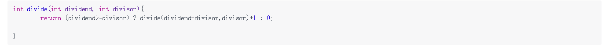
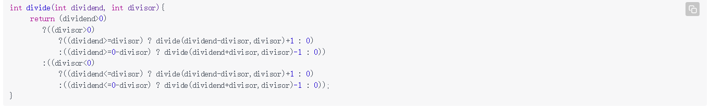
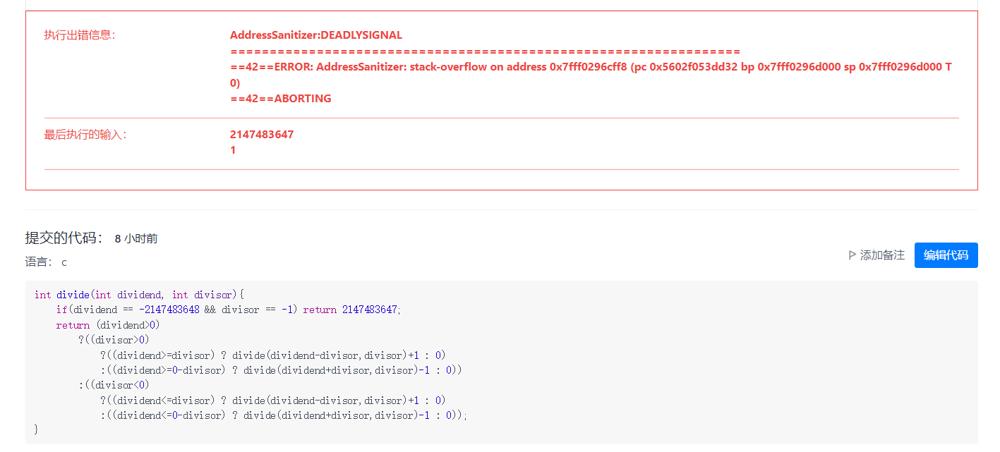
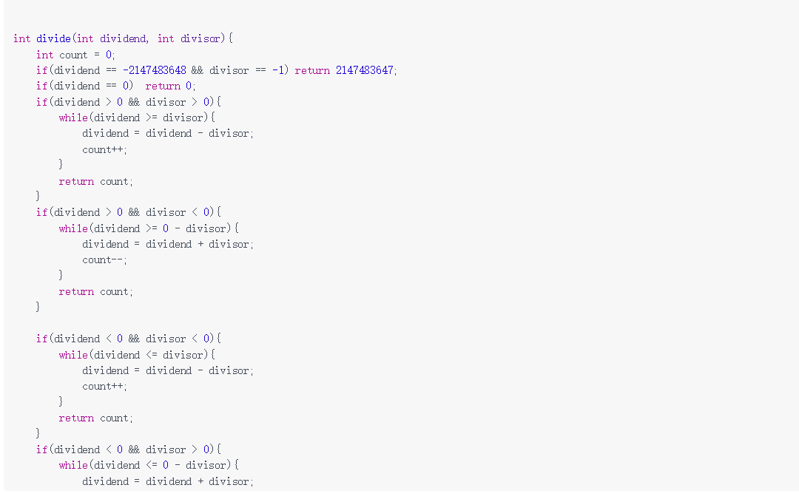
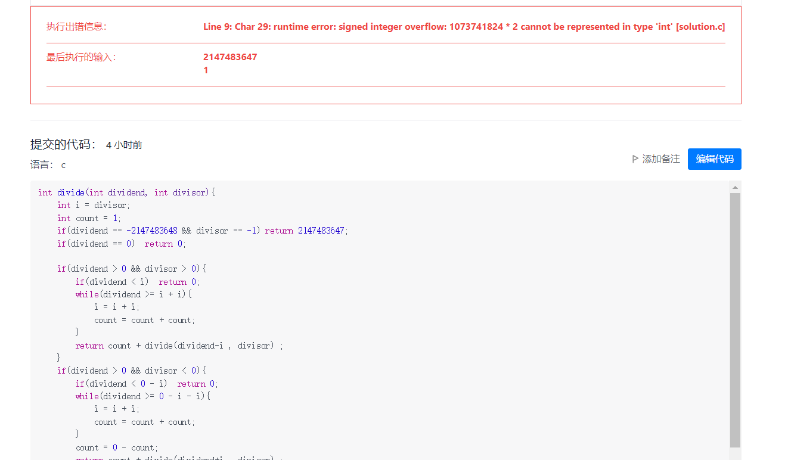
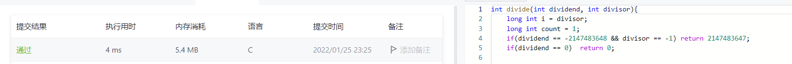

# 29两数相除
给定两个整数，被除数dividend和除数divisor。将两数相除，要求不使用乘法、除法和 mod 运算符。返回被除数dividend除以除数divisor得到的商。
整数除法的结果应当截去（truncate）其小数部分，例如：truncate(8.345) = 8 以及 truncate(-2.7335) = -2

这道题花了我挺长时间的，题目要求不可以使用乘法和除法，一开始的想法是这样的，比如10/3=(10-3)/3+1，就想到的递归算法，也没有考虑负数就直接写下去了。

提交发现，没看清题目，这个函数也要满足负数的运算，接下来就把能满足负数的要求写上去了。
还是有问题当被除数等于-2147483648，除数等于-1时，结果因该为2147483648。但是int型的范围为：-2^31^~2^31^-1,是取不到2147483648的，会溢出，还是没注意看题目，题目中都提示了，于是把这个条件加上去了。

又报错，看了一下错误原因，好像是栈溢出，不能用递归？看来递归还挺废空间的，就把递归方法给去掉了，换成循环就重新写了一遍。

好家伙，直接给我整超时了，麻了，看了一会其他大佬的解答，发现之前用的方法时间复杂度比较大，比如20/3,按我之前的方法要循环6次，那位大佬方法是这样的，定义一个计数count=1,让3翻倍等于6，让6翻倍等于12，然12翻倍等于24，大于20了，就然3翻倍到12，count也翻两次为4，接着用相同的方法求(20-12)/3；递归就形成了，但是这次的时间复杂度降低了，当数值越大，降低的次数会越多，呈指数次方的下降。按他的方法自己写了一遍

没想得还是有报错，看了一下原因，好像是自己定义的int型变量溢出了，接下来换成了long int终于成功了。
