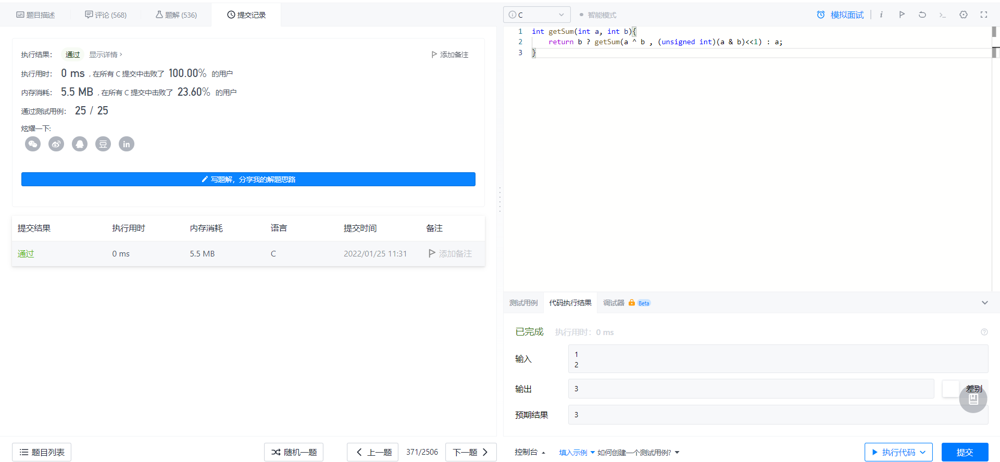

# 371两数之和
题目描述：给你两个整数 a 和 b ，不使用 运算符 + 和 -计算并返回两整数之和。
```
思考：
①题目要求不可以使用运算符号，所以优先考虑位运算。
②a^b可以看成无进位的加法，例如0111^0101=0010;
③进位可以通过a&b算得，因为只有1&1=1，1+1才进位，所以选择与运算来判断哪些位需要进位，又因为进位是进到上一位，所以(a&b)<<1才是进位的结果。
④所以a+b=(a^b)+((a&b)<<1)，因为不可以使用+符号；因此继续调用getSum函数，直到进位的结果为0，a^b=a+b。
⑤防止最高位溢出，所以左移时，将有符号数转成无符号位数运算。
```
```c
int getSum(int a, int b){
    return b ? getSum(a ^ b , (unsigned int)(a & b)<<1) : a;
}
```
