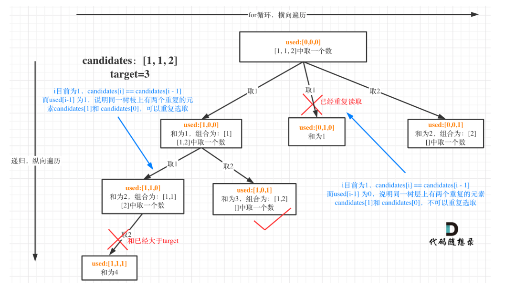

# 40组合总和
```c
int **p;
int *p1;
int *p2;
int p1_k;
int S;
void backtracking(int * candidates, int target, int candidatesSize, int start, int *returnSize, bool *use){
    if(S == target){
        p[*returnSize] = (int* )malloc(sizeof(int) * p1_k);
        memcpy(p[*returnSize], p1, sizeof(int) * p1_k);
        p2[*returnSize] = p1_k;
        (*returnSize)++;
        return ;
    }
    for(int i = start; i < candidatesSize && S + candidates[i] <= target; ++i){
        //当当前值与前一个值是不相等的，因为是排过序的，因此当前值一定没有被用过,可以选择
        //当当前值与前一个值是相等的，若上一个值已经被用过，则可以继续选择这个值,这样也不会出现重复的子集
        //(最难理解)当当前值与前一个值是相等的，若上一个值没有被选过，说明在前一个树中已经遍历过，继续选择的话就会有重复的子集
        if(i > 0 && candidates[i - 1] == candidates[i] && !use[i - 1]){ 
            continue;
        }
        p1[p1_k++] = candidates[i];
        S += candidates[i];
        use[i] = 1;
        backtracking(candidates, target, candidatesSize, i + 1, returnSize, use);
        use[i] = 0;
        S -= candidates[i];
        --p1_k;
    }
    return ;
}

int cmp(const void* p1, const void* p2){
    return *(int* )p1 - *(int* )p2;
}
int** combinationSum2(int* candidates, int candidatesSize, int target, int* returnSize, int** returnColumnSizes){
    *returnSize = 0;
    S = 0;
    p1_k = 0;
    bool use[candidatesSize];
    memset(use, 0, sizeof(use));
    qsort(candidates, candidatesSize, sizeof(int), cmp);
    p = (int** )malloc(sizeof(int* ) * 10000);
    p2 = (int* )malloc(sizeof(int) * 10000);
    p1 = (int* )malloc(sizeof(int) * target);
    backtracking(candidates, target, candidatesSize, 0, returnSize, use);
    *returnColumnSizes = (int* )malloc(sizeof(int) * (*returnSize));
    for(int i = 0; i < *returnSize; ++i){
        (*returnColumnSizes)[i] = p2[i];
    }
    // for(int i = 0; i < *returnSize; ++i){
    //     for(int j = 0; j < p2[i]; ++j){
    //         printf("%d ", p[i][j]);
    //     }
    //     printf("\n");
    // }
    return p;
}
```
和题39类似，这道题每一个数值只能用一次，因为给定的数值是可以重复的，所以满足要求的数值可能会有重复，比如[1,1,2],target=3,则满足要求的数组为[1,2].
