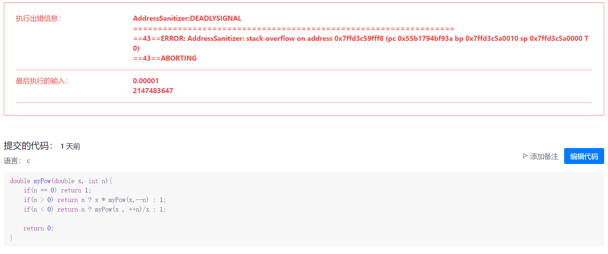
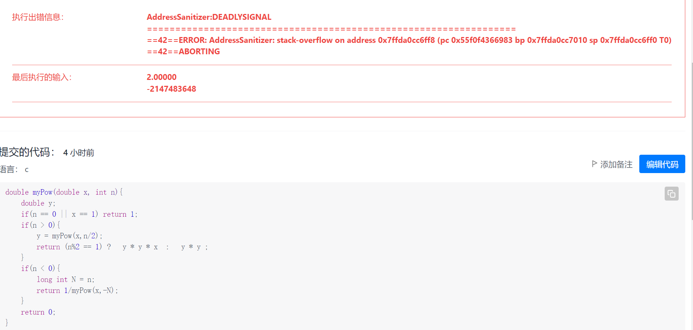
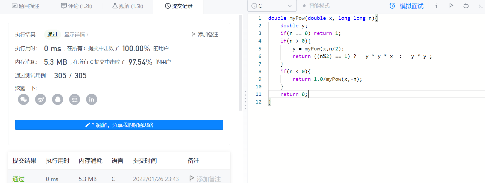

# 50幂函数

实现 pow(x, n) ，即计算 x 的 n 次幂函数（即，x^n^ ）。

分析：
这道题看到就应该想到递归做法，写下来提交后发现
是栈满了，递归的次数太多，于是就想了想二分法。比如x^10^=x^5^ * x^5^,x^11^=x^5^ * x^5^ * x;x^5^继续递归，这样递归的次数就少了，又提交了一下

又有报错，这问题是一点头绪没有，看了一下评论，好像-2^31^-1取反递归时，传到入口参数时会溢出，于是就把int n改成了long long n型，就正确了
