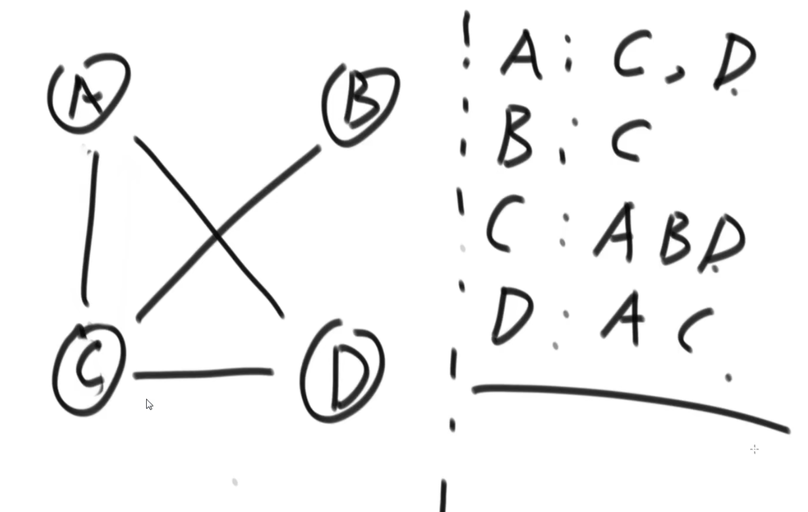
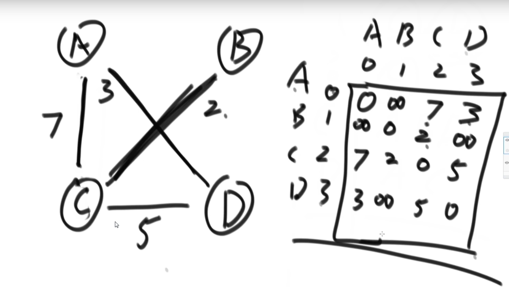
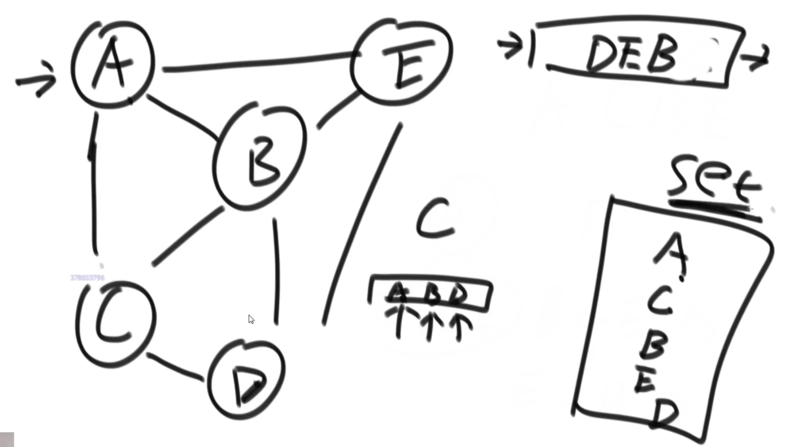
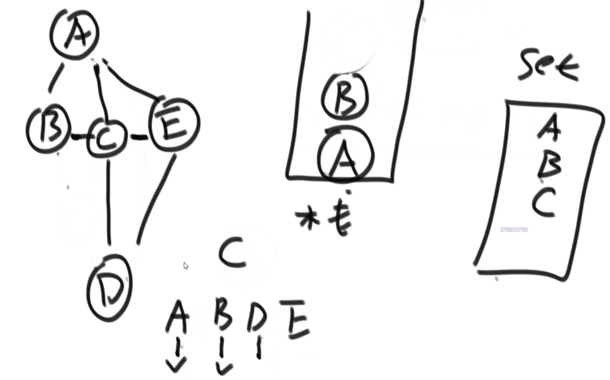

# 图
[学习视频](https://www.bilibili.com/video/BV13g41157hK?p=8&spm_id_from=pageDriver)
## 图的储存方式
1.邻接表

2.邻接矩阵

## 数据项结构
```java
# 图
public class Graph{
	public HashMap<Integer, Node> nodes;    #点集 Integer 表示点的编号  Node 表示实际的点
	public HashSet<Edge> edges;             #边集

	public Graph(){
		nodes = new HashMap<>();
		edges = new HashSet<>();
	}
}

# 点
public class Node {
	public int value;
	public int in;
	public int out;
	public ArrayList<Node> nexts;
	public ArrayList<Edge> edges;

	public Node(int value) {
		this.value = value;
		in = 0;
		out = 0;
		nexts = new ArrayList<>();
		edges = new ArrayList<>();
	}
}

# 边
public class Edge {
	public int weight;
	public Node from;
	public Node to;

	public Edge(int weight, Node from, Node to) {
		this.weight = weight;
		this.from = from;
		this.to = to;
	}

}


```

## 数组转化为图结构
理解为：数组的其中一行为[1,2,3]理解为1->2,长度为3，最终转化为图的结构，用图的方法去解决问题。
```java
public class GraphGenerator {

	public static Graph createGraph(Integer[][] matrix) {
		Graph graph = new Graph();
		for (int i = 0; i < matrix.length; i++) {
			Integer weight = matrix[i][0];              //长度
			Integer from = matrix[i][1];                //起始点
			Integer to = matrix[i][2];          		//终点
			if (!graph.nodes.containsKey(from)) {
				graph.nodes.put(from, new Node(from));
			}
			if (!graph.nodes.containsKey(to)) {
				graph.nodes.put(to, new Node(to));
			}
			Node fromNode = graph.nodes.get(from);
			Node toNode = graph.nodes.get(to);
			Edge newEdge = new Edge(weight, fromNode, toNode);
			fromNode.nexts.add(toNode);
			fromNode.out++;
			toNode.in++;
			fromNode.edges.add(newEdge);
			graph.edges.add(newEdge);
		}
		return graph;
	}
}
```

## 宽度优先遍历

理解为：A点出队列，A的下一点为B,C,E且与A都不相同，都记录到哈希表中，假设下一点为C点，C,B,E依次入队列(B,E循序不唯一)，接下来C点出队列，C的下一点为A,B,D，其中A,B都有在哈希表记录，跳过，将D点记录到队列中。最终依次循序为A->C->B->E->D.
```java

public static void bfs(Node node) {
    if (node == null) {
        return;
    }
    Queue<Node> queue = new LinkedList<>();   //队列
    HashSet<Node> map = new HashSet<>();      //哈希表
    queue.add(node);
    map.add(node);
    while (!queue.isEmpty()) {
        Node cur = queue.poll();
        System.out.println(cur.value);
        for (Node next : cur.nexts) {
            if (!map.contains(next)) {
                map.add(next);
                queue.add(next);
            }
        }
    }
}
```
## 深度优先遍历

理解为：A点出栈,A的下一点为B,C,E,假设下一点为B,将B点返回到栈中,跳过C,D点,接下来B点出栈,B的下一点为A,C,A点已经走过,则走C点,将C点继续返回到栈中,接下来C点出栈,依次进行，最终循序为A->B->C->D->E(循序不唯一)。
如果第二个点为C点，是走不到所有点的，故第二个点只能为B或E,程序回返回到A出栈，重新遍历。
```java
public class Code02_DFS {

	public static void dfs(Node node) {
		if (node == null) {
			return;
		}
		Stack<Node> stack = new Stack<>();
		HashSet<Node> set = new HashSet<>();
		stack.add(node);
		set.add(node);
		System.out.println(node.value);
		while (!stack.isEmpty()) {
			Node cur = stack.pop();
			for (Node next : cur.nexts) {
				if (!set.contains(next)) {
					stack.push(cur);
					stack.push(next);
					set.add(next);
					System.out.println(next.value);
					break;
				}
			}
		}
	}

}

```
