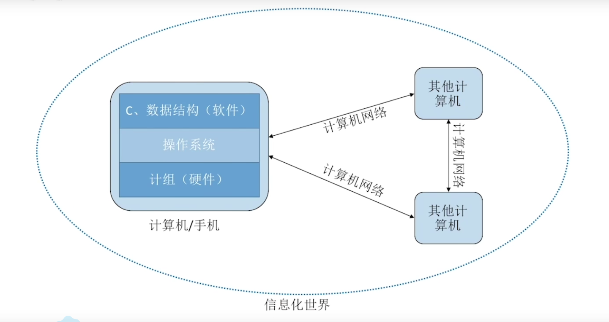
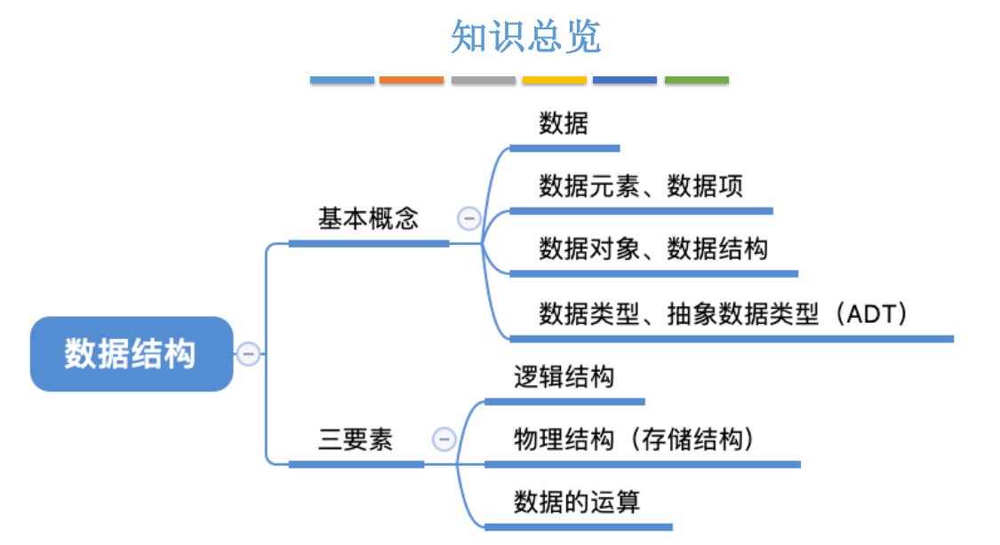
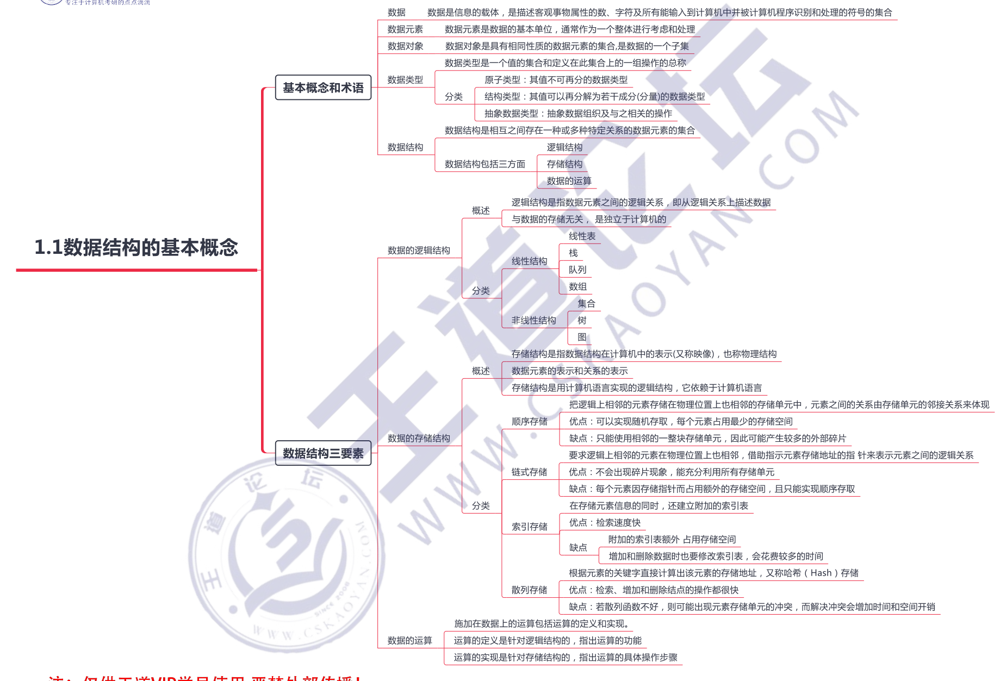
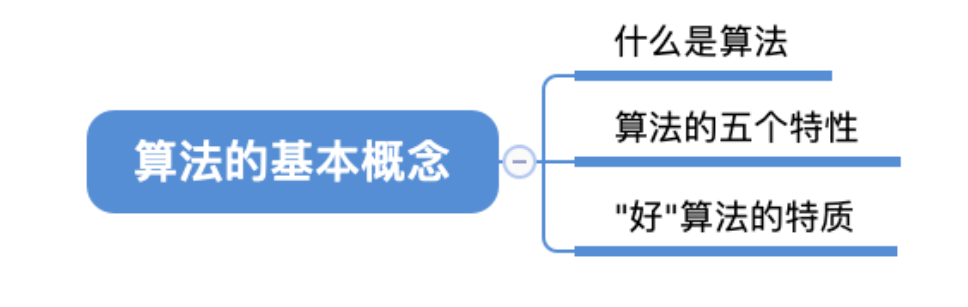
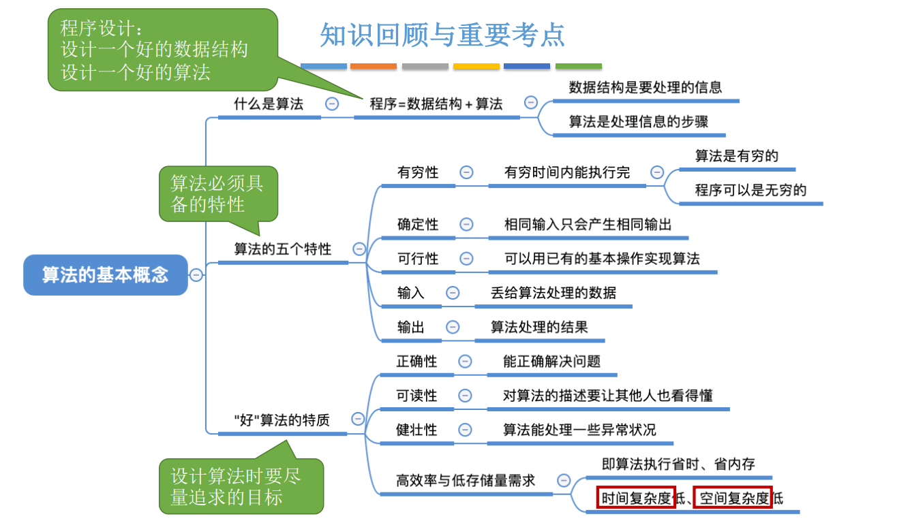
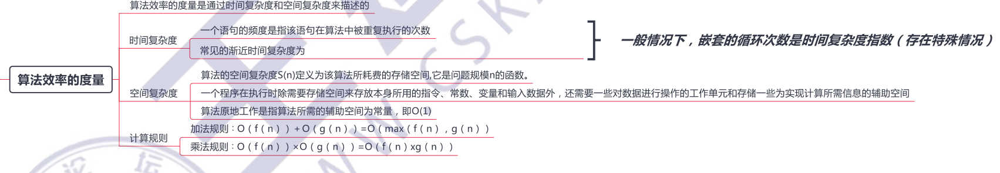
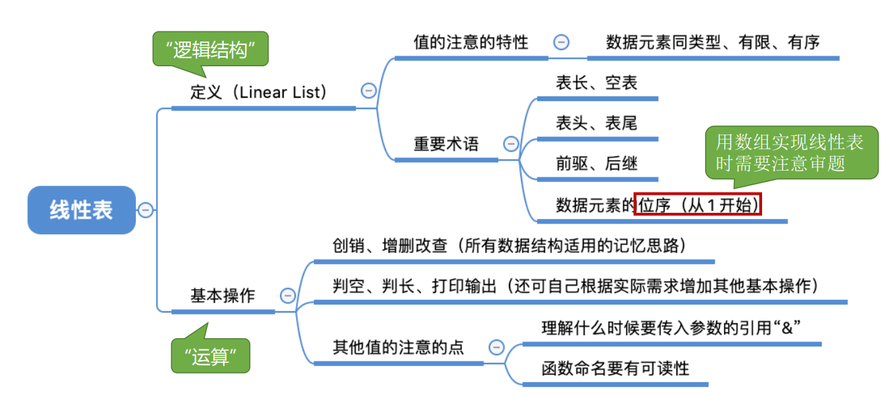

# 数据结构
[学习视频](https://www.bilibili.com/video/BV1b7411N798?p=2&spm_id_from=pageDriver)

四者之间的关系


### 1.1数据结构的基本概念


### 1.2.1算法的基本概念


### 1.2.2时间复杂度和空间复杂度


### 2.1线性表的定义

### 2.2.1顺序表的定义
1.定义
用顺序存储的方式实现线性表顺序存储。把逻辑上相邻的元素存储在物理位置上也相邻的存储单元中，元素之间的关系由存储单元的邻接关系来体现。

2.静态分配
```c
#define MaxSize 10
typedef struct{
    ElemType data[MaxSize];         //ElemType是数据类型，类如int;sizeof(ElemType)可以确定数据元素的大小
    int length;
}SqList;

//举例
```