# 计算机组成原理
### 2.1.1 BCD码
BCD码映射关系

这里需要注意的是==BCD码中1010-1111没有定义==，所以由二进制加法得5+8=1101，还要加上110（6）进行修正，得到1 0011（BCD码）。
补充

### 2.1.2  字符与字符串
#### ASCII码

例题:已知‘h’的ASCII码值为104，字符‘a’存放在存储单元M1中，字符‘z’存放在
存储单元M2中，求M1、 M2中存放的内容。
```
a : 104 – (8-1) = 97 —> M1中内容为0110 0001
z : 104 + (26-8) = 122 —> M2中内容为0111 1010
```
#### 区位码，国际码，汉字码

注意的是，区位码的两个字节分别加上20H得到国际码，防止==与“通信/控制字符”冲突==。
国际码的两个字节分别加上80H得到汉字内码。==保证高位为1，与ASCII码区分==，因为ASCII码一共只有128个字符，所以ASCII码的最高为0。
### 2.1.3校验原理与奇偶校验码
#### 校验原理

==码字==：由若干位代码组成的一个字，上图中，A，B，C，D分别为一个码字。将两个码字逐位对比，具有不同的位的个数称为==两个码字间的距离==。各码字之间的最小距离称为==码距d==。
当d=1时，无检错能力；当d=2时，有检错能力，无纠错能力。
#### 奇偶校验码
奇校验码：整个校验码（有效信息位和校验位）中“1”的个数为奇数。
偶校验码：整个校验码（有效信息位和校验位）中“1”的个数为偶数。

在==最高位中添加奇偶校验位==，使得整个校验码无进位加权和为1的为奇校验，和为0的为偶校验。
缺点：1.如果在偶校验中==接收的码距d=2==;是无法检测出来的，比如发出的码为011，接收的码为000，奇偶校验是检测不出来的。
2.无法确定是哪一位出错。

### 海明校验码

其中n是信息位，k为校验位。
```
P1=D1^D2^D4  
#其中D1,D2,D4是如何确定的呢？
D1对应的H3，3的二进制为011
D2对应的H5，5的二进制为101
D3对应的H6，6的二进制为110
D4对应的H7，7的二进制为111
将二进制末尾为1的值互相异或，最终结果是P1。
P2,P3依次类推为别是第二位和第一位为1的值互相异或。
```

### 循环冗余校验码(CRC码)
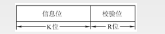
 例：设生成多项式为G(x)=x^3^+x^2^+1，信息码为101001，求对应的CRC码。
 
 
 需要注意的是，出错位与余数的关系并不是二进制的关系。
 
 

 ### 定点数的表示
 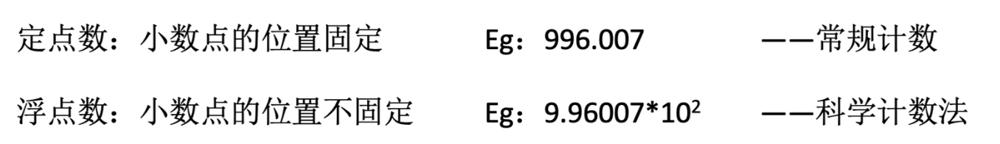
 ==无符号数==： 整个机器字长的全部二进制位均为数值位，==没有符号位==，相当于数的绝对值。
 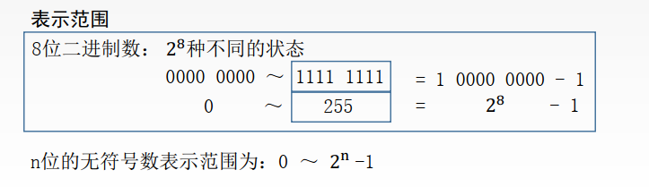
==原码==
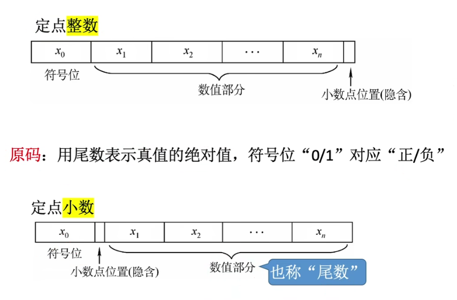
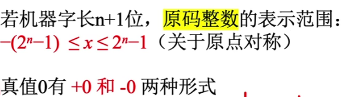
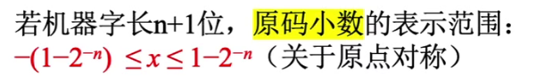
==反码==
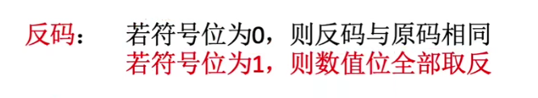
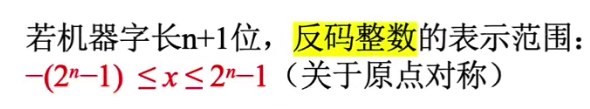
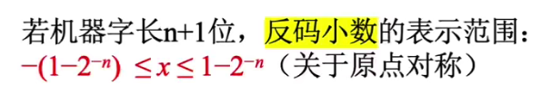
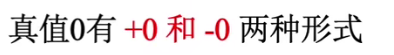
==补码==
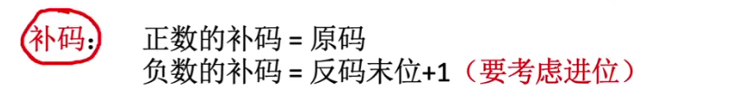
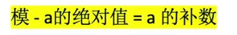
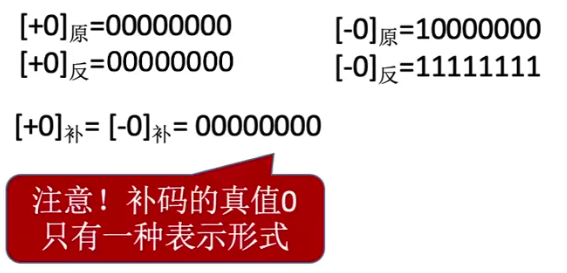
特别的
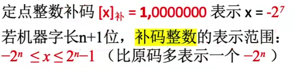
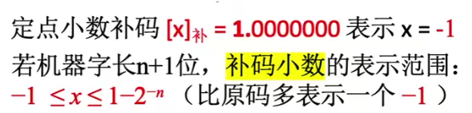
==移码==
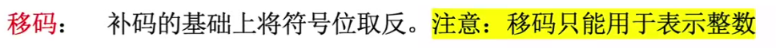
总结
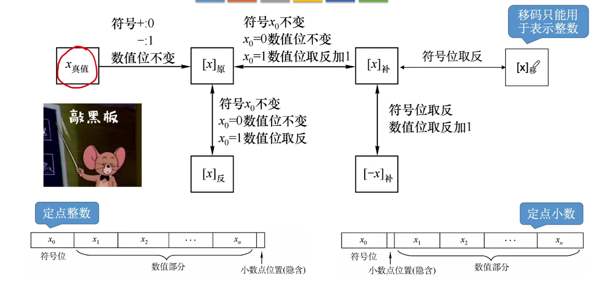
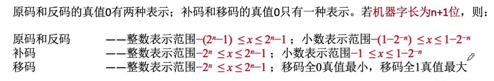
### 2.2.2原码补码移码的作用
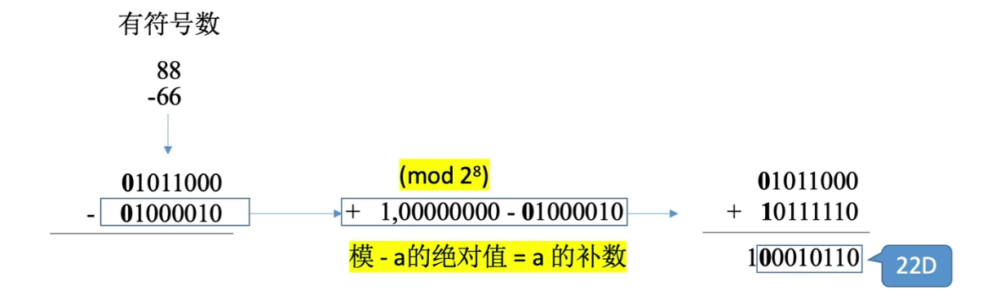
理解为：88+(-66的补码)
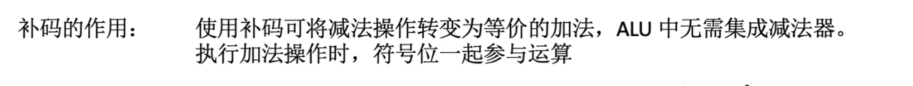
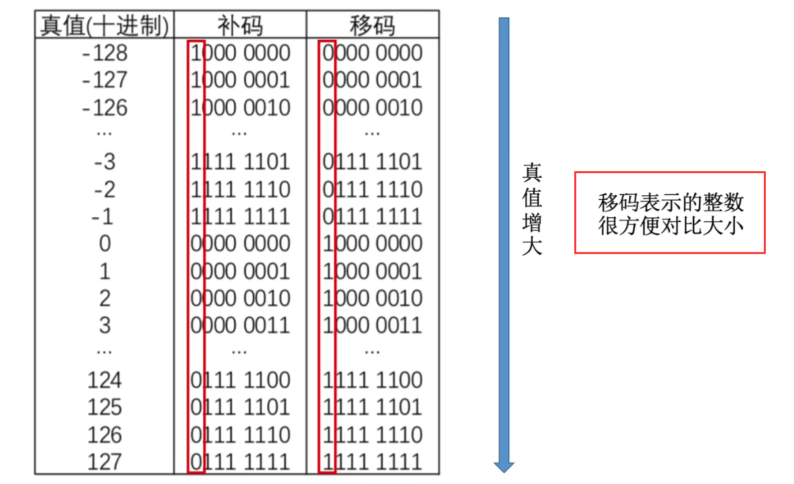
### 2.2.3 移位运算
==原码的算数移位==
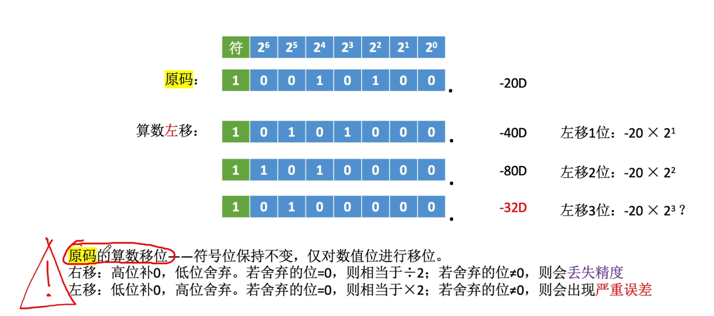
==反码的算数移位==
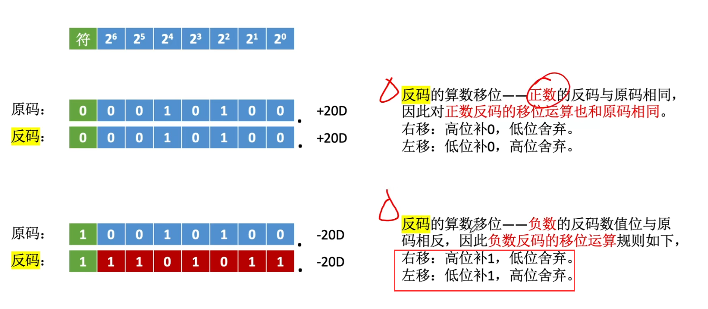
==补码的算数移位==
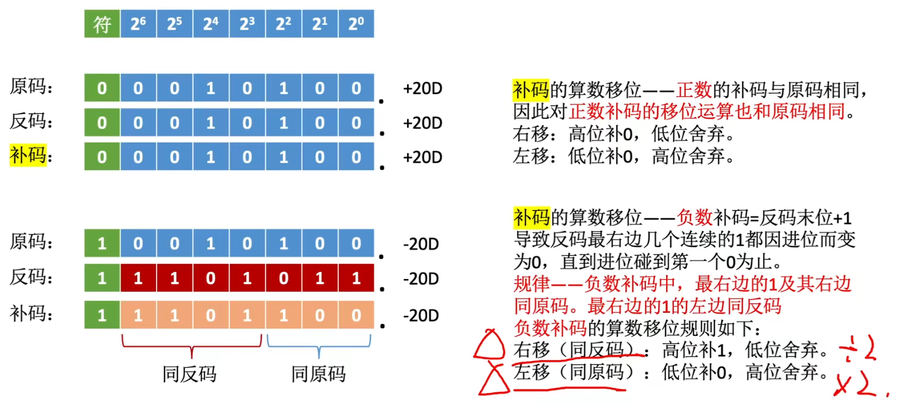
==注意==：补码的补码等于原码；
负数补码的求解方法
①所有位取反，加一为补码。
②将最右侧的1，左侧取反(==不包括符号位==)，右侧不变，结果为补码。
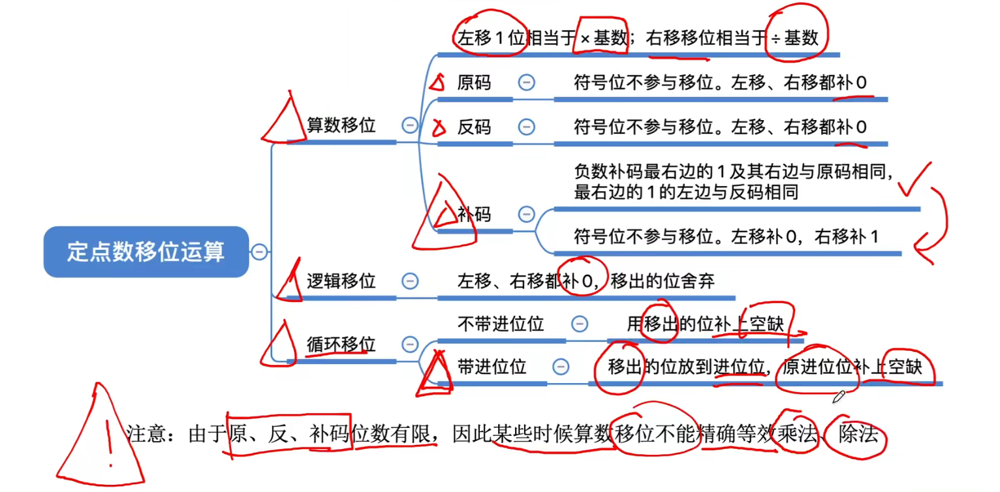